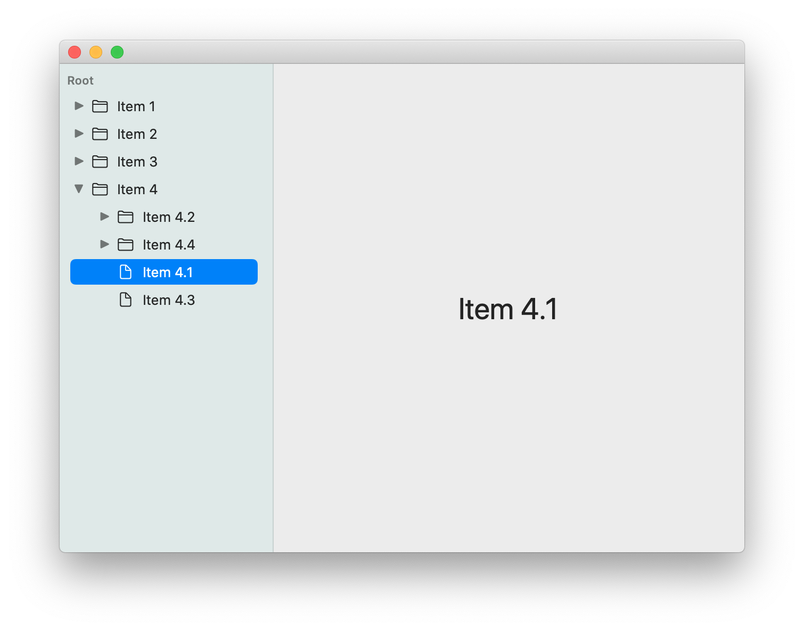

# OutlineView

A small, simple implementation of a hierarchical outline view in SwiftUI. This project contains a small example application.

I kept running into an issue where SwiftUI would lose the open-closed state of folders when they disappeared, so the app tracks open-closed state through a separate class. There are a few branches where I've tried to work around this need in a few ways, as yet unsuccessfully.
